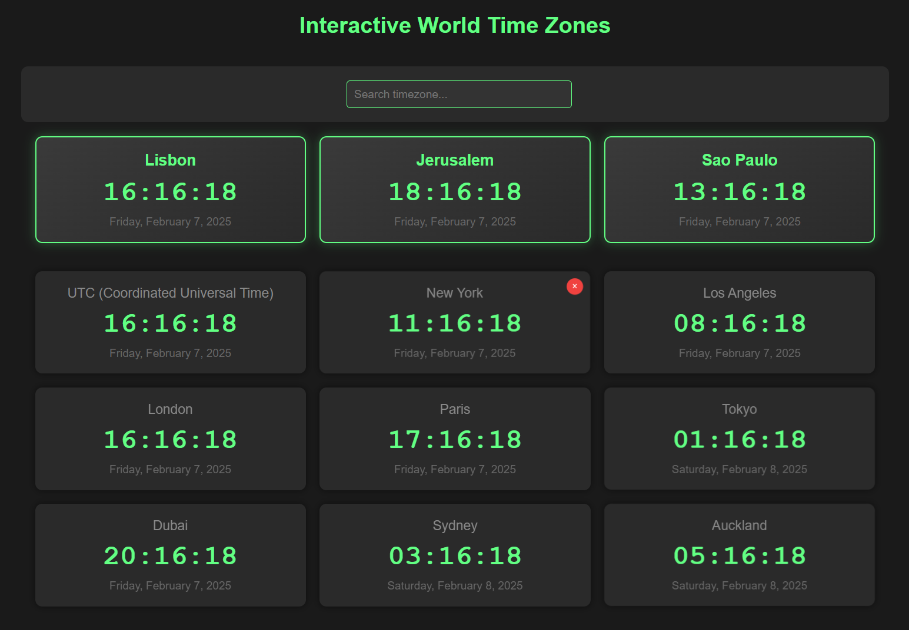

# Interactive World Time Zones

This project is an interactive world time zone application created with the help of GitHub Copilot. It allows users to view the local time of multiple regions worldwide in an intuitive and customizable way.

This project was created as a **prototype** to explore Github Copilot. It is still in its early stages and may have limitations or incomplete features.

## 🚀 Project Status

🛠️ **Phase:** Prototype  
⚠️ **Disclaimer:** This project is still under development and may contain bugs or future changes.

## 📌 Access the Project  
🔗 [Interactive World Time Zones](https://olavogiamp.github.io/Interactive-World-Time-Zones/)

## 🎯 Features  

✅ **View multiple time zones** – Add and display multiple clocks for different locations worldwide.  
✅ **Interactive time zone search** – Easily search for any time zone using the smart search bar.  
✅ **Drag and rearrange clocks** – Clocks can be freely moved to organize them as you prefer.  
✅ **Highlight important time zones** – Some clocks can be pinned as featured.  
✅ **Modern and responsive design** – Dark-themed, elegant interface compatible with both mobile and desktop devices.  
✅ **Real-time updates** – The clocks update automatically.  
✅ **Easily remove clocks** – Click the delete button to remove a clock from the display.  

## 🛠️ Technologies Used  

- **HTML5** – Structure of the site  
- **CSS3** – Modern and responsive styling  
- **JavaScript (Vanilla JS)** – Interactive functionality and DOM manipulation  

## 🚀 How It Works  

1. Visit the website: [Interactive World Time Zones](https://olavogiamp.github.io/Interactive-World-Time-Zones/).  
2. Use the search bar to find a specific time zone.  
3. Click on a time zone from the list to add it to the interface.  
4. Drag the clocks to rearrange them as desired.  
5. Remove a clock by clicking the delete button.  

## 📸 Demo  

## 📜 License  

This project is open-source and can be freely used for learning and improvements.

## 🔥 Possible Improvements and Future Features

Here are some ideas to expand and enhance the project:

- [ ] **Improved UI/UX** – Enhance design and user experience.
- [ ] **Multi-platform support** – Adapt for mobile, desktop, or responsive web.
- [ ] **Database integration** – Implement data persistence (e.g., Firebase, SQLite, PostgreSQL).
- [ ] **User authentication** – Login via email/password or social media.
- [ ] **Automated testing** – Improve reliability with unit and integration tests.
- [ ] **Internationalization (i18n)** – Support for multiple languages.
- [ ] **Offline mode** – Allow the app to work without an internet connection.
- [ ] **Integration with external APIs** – Add extra functionalities, such as real-time data.
- [ ] **Performance optimization** – Reduce loading times and resource consumption.

## 💡 Additional Ideas

If you have suggestions or would like to contribute, feel free to open an **issue** or submit a **pull request**! 😃

